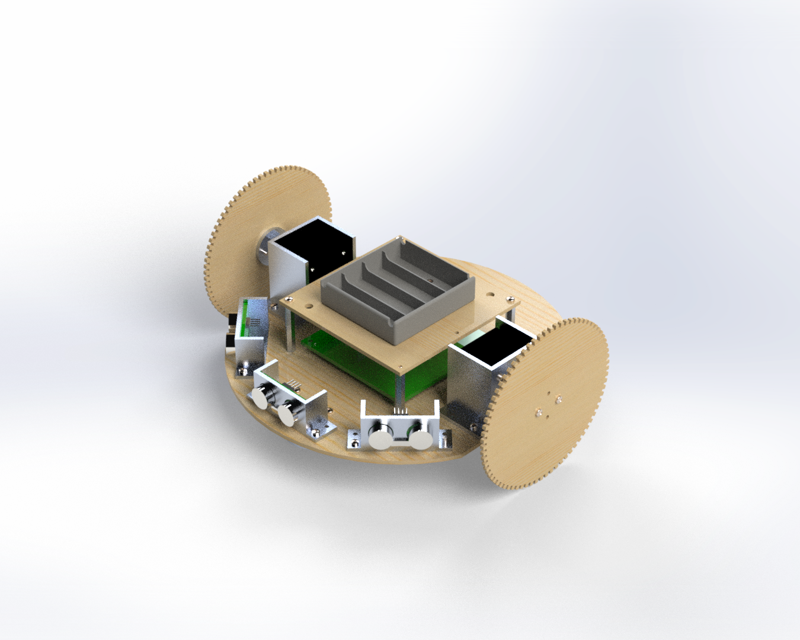
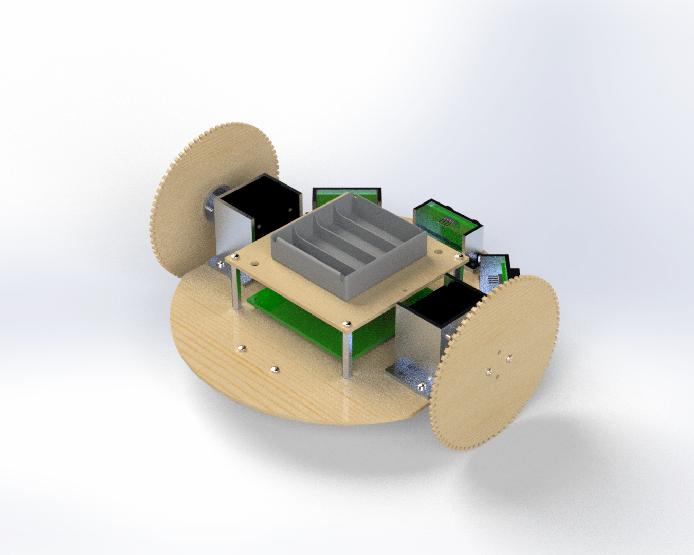

# My Other Robot for Education (MORE)


## Introduction

Welcome to my repository for my My Other Robot for Education (MORE) project.

<div>
    
    
</div>

## Motivation

I started this project after developing my LORE robot (see [http://github.com/DrFKNoble/lore](http://github.com/DrFKNoble/lore)) and seeing how low-cost components affected the robot's performance.

One of the main problems the robot had was that the continuous rotation servo motors I used would start to "drift" after some time (and would need to be manually tuned when they did). So I decided to build a better robot, which used stepper motors instead on servo motors.

## Aims

The aims of this project included:
- Improving upon LORE's performance by using more robust components.
- Developing another mobile robot that, this time, can be used to teach students the principles of mechatronics and robotics.

## Objectives

The objectives of this project included:
- Creating accessible Computer Aided Design (CAD) files.
- Creating accessible Electronics Design Automation (EDA) files.
- Creating accessible source code and software libraries.
- Creating an easy-to-assemble mobile robot that uses an Arduino microcontroller, stepper motors, stepper motor drives, and ultrasonic sensors.

## Repository Structure

The repository is organised as follows:

```console
/MORE      
    /cad                          
        /solidworks                    
        /freecad
        /fabrication
        /renders                     
    /pcb
        /eagle
        /kicad
        /fabrication
    /src
    /doc                      
        /img
        /programming_guide
```

All CAD files can be found in the `/cad` sub-directory. I've included the original SOLIDWORKS files and the open-source equivalents.

All EDA files can be found in the `/pcb` sub-directory. I've included the original Eagle files and the open-source equivalents.

All source code and software libaries are included in the `/src` sub-directory.

Documentation is included in the `/doc` sub-directory.

## Tools Used

I have used the following tools in this project:
- SOLIDWORKS and FreeCAD.
- Eagle and KiCAD.
- Microsoft Visual Studio and Arduino Integrated Development IDE (IDE).

Get FreeCAD here: https://www.freecadweb.org/.  
Get KiCAD here: https://www.kicad.org/.  
Get Arduino IDE here: https://www.arduino.cc/en/software.  
Get Visual Studio here: https://visualstudio.microsoft.com/.  

Alternatively, you can use Microsoft Visual Studio Code as the IDE.

Get Code here: https://code.visualstudio.com/.

## Credit

Dr Frazer K. Noble  
http://drfknoble.com
